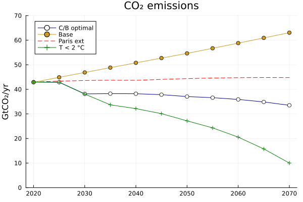
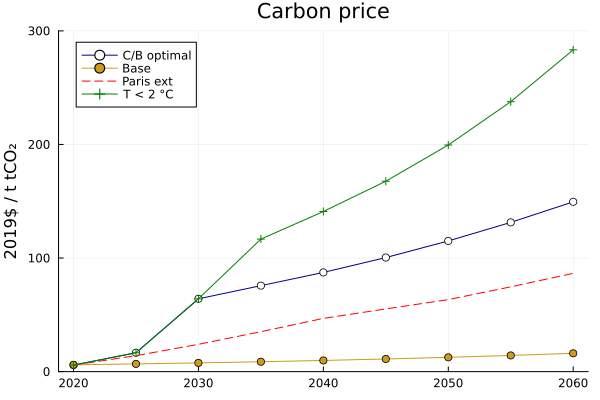

# DICEModel

A Julia/JuMP port of the Nordhaus' DICE (Dynamic Integrated Climate-Economy model) and Nordhaus/Yang RICE (Regional Integrated Climate-Economy model) models.

This package currently implements "exactly" (in structure, data and hence output) the DICE2023-b-4-3-10.gms gams version and generalize it introducing a regional dimension that can be used to implement RICE-like models.

[](https://github.com/sylvaticus/DICEModel.jl/actions)
[](https://codecov.io/gh/sylvaticus/DICEModel.jl)
[](https://sylvaticus.github.io/DICEModel.jl/stable)
[](https://sylvaticus.github.io/DICEModel.jl/dev)

**This program and output is not the original Barrage/Nordhaus version, which is currently only [available in GAMS](https://bit.ly/3TwJ5nO).**

While `DICEModel.jl` is _implemented_ in Julia it can easily be used in Python or R using the [`JuliaCall` (Python)](https://github.com/JuliaPy/PythonCall.jl) and [`JuliaCall` (R)](https://cran.r-project.org/web/packages/JuliaCall/index.html) packages respectively. 

## Goals of this package

Provide a practical, full open-source (using all open-source tools) implementation of the latest version of the D(R)ICE model, keeping the model readable, compact and as close as possible to the original (GAMS) code.   

This package provides two functions to run the model:
- `run_dice_scenario(scenario_name)` [[browse code](https://github.com/sylvaticus/DICEModel.jl/blob/main/src/Scenarios.jl) - [documentation](https://sylvaticus.github.io/DICEModel.jl/dev/api.html#DICEModel.run_dice_scenario-Tuple{String}) ] : runs one of the "official" 10 scenarios of DICE2023;
- `run_dice(pars;optimizer,bounds)` or `run_dice(;optimizer,bounds,kwargs...)` [[browse code](https://github.com/sylvaticus/DICEModel.jl/blob/main/src/CoreModel.jl) - [documentation](https://sylvaticus.github.io/DICEModel.jl/dev/api.html#DICEModel.run_dice-Tuple{DICEParameters}]  : run DICE with custom solver engine (and eventually options), custom variable constraints (bounds) or custom parameters (see [DICEParameters](https://sylvaticus.github.io/DICEModel.jl/dev/api.html#DICEModel.DICEParameters)).

The parameter struct `pars` in the `run_dice` function above is an istance of the [`DICEPararameters`](hhttps://sylvaticus.github.io/DICEModel.jl/dev/api.html#DICEModel.DICEParameters) struct, and can be created using several functions, each implementing some "defaults" that can be overridded with keyword arguments.
For example `DICE2023(;kwords...)` defaults to the `DICE2023` model, while `RICE2023(;kwords...)` defaults to a 12 regions RICE-like model. 

One of the parameters is `weights`. These are fully exogenous utility weights for each region. They are not the Nagishi weights, but default to equal weigths (eventually one can compute the Nagishi weights by iteractivelly calling the `run_dice` function with different weights).

The output (results) or `run_rice` is a named tuple. Use `keys(results)` to find the available information (or just look at the source code) and `results.VARIABLEX` to obtain the values.

A summary of the main results is available [on this page](https://sylvaticus.github.io/DICEModel.jl/dev/results.html).


## Example

```julia
using Pkg
Pkg.activate(@__DIR__)
Pkg.add(["DICEModel","Plots"]) # run only once, then comment out
using DICEModel, Plots

# CB Optimal scenario...
res_cbopt    = run_dice_scenario("cbopt")

# Base scenario...
res_base    = run_dice_scenario("base")

# Paris "extended" scenario...
tidx = 1:81
# upper limit to emissions mitigation rate
miuup = @. min( 0.05 + 0.04*(tidx-1) - 0.01*max(0,tidx-5)  ,1.00) 
res_parisext = run_dice(miuup = miuup) # or simply: run_dice_scenario("parisext")

# Max 2 °C scenario...
res_t2c = run_dice(bounds = Dict("TATM"=>("<=",2.0))) # or simply: run_dice_scenario("t2c")

# Plots
times = res_cbopt.times

# CO2 emissions plot...
plot(times[1:11],res_cbopt.ECO2[1:11],ylim=(0,70), title="CO₂ emissions",ylabel="GtCO₂/yr",label="C/B optimal", color=:blue4, markershape=:circle, markercolor=:white)
plot!(times[1:11],res_base.ECO2[1:11], label="Base", colour=:goldenrod3, markershape=:circle, markercolor=:goldenrod3)
plot!(times[1:11],res_parisext.ECO2[1:11], label="Paris ext", colour=:red, linestyle=:dash)
plot!(times[1:11],res_t2c.ECO2[1:11], label="T < 2 °C", colour=:green, markershape=:cross, markercolor=:green)

# Carbon price plot...
plot(times[1:9],res_cbopt.CPRICE[1:9],ylim=(0,300), title="Carbon price",ylabel="2019\$ / t tCO₂",label="C/B optimal", color=:blue4, markershape=:circle, markercolor=:white)
plot!(times[1:9],res_base.CPRICE[1:9], label="Base", colour=:goldenrod3, markershape=:circle, markercolor=:goldenrod3)
plot!(times[1:9],res_parisext.CPRICE[1:9], label="Paris ext", colour=:red, linestyle=:dash)
plot!(times[1:9],res_t2c.CPRICE[1:9], label="T < 2 °C", colour=:green, markershape=:cross, markercolor=:green)
```

 

```julia
w_rich  = [5,4,3,3,1,1,3,2,2,1,1.5,1] # utility weights with over-representation to developed countries
res_cbopt_12r_rich = run_dice(RICE2023(;weights=w_rich))
```

## Other packages or implementations of the DICE model

- [DuBois Julia implementation](https://github.com/Libbum/DICE.jl): No updates to DICE 2023, code divided in many pieces
- MIMI framework based implementations (eg. [v2016](https://github.com/AlexandrePavlov/MimiDICE2016.jl) or [v2016R2](https://github.com/anthofflab/MimiDICE2016R2.jl)): Not updated to DICE 2023, code divided in many pieces (different implementation and solver structure)
- [olugovoy implementation in various languages (Julia included)](https://github.com/olugovoy/climatedice): No updates, code very "R like"
- [Benet and Akshay MATLAB implementation](https://github.com/ebenetce/DICE2023) : Still require MATLAB, code not readable/compact as GAMS or JuMP
- [Nie and Welch Python implementation](https://ivo-welch.info/research/dice/header.html) : Code not readable/compact as GAMS or JuMP

## Licence
The licence of the original GAMS code has never being specified. The Julia port itself (and only that) is MIT.

